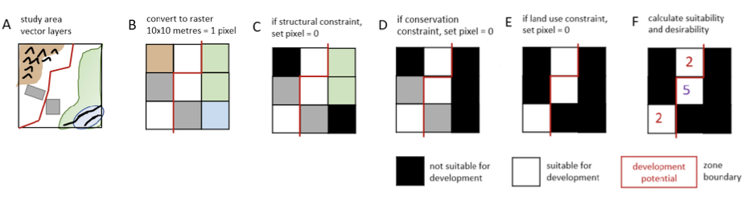

Deep learning for land development
================

## Intro

This repository holds a deep learning model built with [pytorch](https://pytorch.org).

## Background

Land use patterns can be extremely complex, on the one hand depending on
the natural features of the environment, such as rivers, mountains etc…
on the other reflecting how humans got to use a specific parcel of land
other the years, decades and even centuries. This model is developed to
predict a set of variables about a location, based on the knowledge of
the variables in the neighborhood.

## Data

We use as input a set of rasters, each modelling a feature of the
environment (flood risk, population, slope etc…) covering the region of
Oxfordshire.

## Sampling

A sampling procedure was developed in order to create a training,
validation and testing data sets. It consists in drawing from the whole
grid an individual cell and its nearest neighbors. So for a set of $N_f$
features (or raster) over a grid of $N_x\times N_y$ cells, and for
n-neighborhoods of cells, we get a *pool* of
$(N_x-2n)\times(N_y-2n)\times N_f$ samples which are then at random
assigned to the training, validation and testing sets at random with
probability of $.7,.15,.15$ respectively.

## Using it

It is in its current state.
